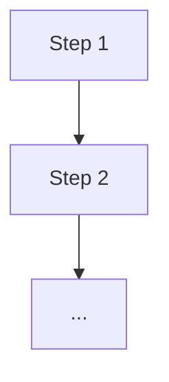

<!--
TEMPLATE INSTRUCTIONS (agentrefinery-design fills this in; remove this block
from the generated Rail's Design.md):

- This is the only one of the 5 documents whose job is to be read by a human
  first, an agent second. Write it so a newcomer understands what the process
  is for and how it flows, without needing to read Backbone/Workflow first.
- Keep it descriptive. Do not restate objectives, hard limits, or step-by-step
  execution detail here — those live in Backbone.md/Workflow.md and this
  document must never become a second, drifting copy of them.
- Diagrams are plain text (Mermaid is fine since it renders as text) — no
  binary/image assets, so the whole context bundle stays diffable and
  git-friendly.
-->

## What this process is for

<1-3 paragraphs: the purpose of the process, who/what it's for, and why it
exists as a Rail rather than a one-off script or a raw prompt.>

## How it flows

<plain-language walkthrough of the process shape, referencing Workflow.md's
steps by name/number but not duplicating their fixed core / judgment zone
detail.>

## Context and constraints

<any background a reader needs to make sense of the Backbone.md objectives
and hard limits — prior decisions, why a limit exists, what was tried and
rejected. Explanatory, not normative.>
